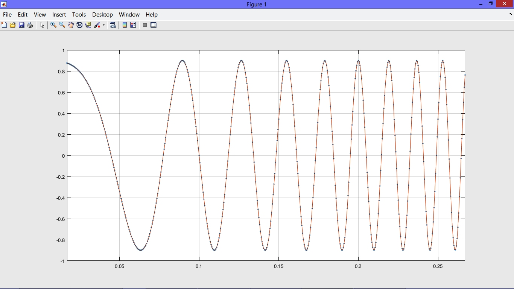

<div align="center">

# 🎛️ Digital Signal Processing — MATLAB Implementations


</div>

---

Hands-on MATLAB exploration of core DSP concepts — from sampling theory verified audibly through a sound card, to a quantization sensitivity study that shows exactly why cascaded biquad filters dominate production embedded systems. Every result here is observable, not just simulated on paper.

---

## What's Inside

| File | What it does |
|------|-------------|
| `q4.m` | Samples a chirp signal at 6 different rates; aliasing heard in real time via sound card |
| `q5.m` | Sliding-window oscilloscope simulation of a live chirp in MATLAB |
| `c1.m` | 12th-order Butterworth noise removal + full coefficient quantization analysis + SOS cascade decomposition |

---

## Chirp Sampling & Aliasing — Nyquist Made Audible

A linear chirp sweeping **0 → 4000 Hz over 16 seconds** was generated analytically:

$$x(t) = \cos\!\left[\phi_0 + 2\pi\!\left(\frac{c}{2}t^2 + f_0\, t\right)\right], \quad c = \frac{f_1 - f_0}{T} = 250 \text{ Hz/s}$$

Then sampled at six rates and played back through the system sound card — turning the Nyquist theorem into something you can hear:

| Sampling Rate | Nyquist Margin | Audible Result |
|--------------|---------------|----------------|
| 30,000 Hz | 3.75× | ✅ Smooth rising pitch |
| 20,000 Hz | 2.5× | ✅ Clean |
| 10,000 Hz | 1.25× | ✅ Clean |
| 8,000 Hz | 1.0× (limit) | ✅ Clean |
| **4,000 Hz** | **0.5× — aliased** | ❌ Signal repeats **twice** |
| **2,000 Hz** | **0.25× — aliased** | ❌ Signal repeats **four times** |

The repetition pattern is exact: each time $F_s$ is halved below the Nyquist limit, the perceived repetition rate doubles — a clean, audible confirmation of spectral folding.

A real-time **oscilloscope simulation** (`q5.m`) renders the chirp frame-by-frame through a sliding 0.25 s window using `drawnow`, letting you watch instantaneous frequency climb in real time.



---

## Butterworth Filter Design & Audio Noise Removal

A **6th-order Butterworth band-stop filter** targets and eliminates a tonal noise spike embedded in `a2.wav`:

```matlab
w1 = 1/4;   dw = 1/20;
[b1, a1] = butter(6, [w1-dw, w1+dw], 'stop');
```

The filter carves a precise notch at $\omega = \pi/4$ rad/sample. All poles sit inside the unit circle — the system is unconditionally stable. Passing the noisy audio through `filter()` removes the screeching artifact entirely, verified both by listening and by comparing time-domain waveforms before and after.

---

## Coefficient Quantization — A Study in Numerical Sensitivity

The core question: **how many bits do filter coefficients actually need?**

Coefficients were rounded to $n$ significant figures via `round(x, n, 'significant')` and the output quality was evaluated audibly and spectrally at each level.

### Direct-Form II (12th-order, monolithic)

| Significant Figures | Result |
|--------------------|--------|
| 6 | ❌ Filter completely fails — no usable output |
| 8 | ⚠️ Partial noise reduction |
| 10 | ⚠️ Faint residual noise (audible with headphones) |
| **12** | ✅ **Clean output** — noise fully eliminated |

With 12 significant figures, coefficients span $[10^{11},\, 10^{12})$, requiring **~37–41 bits** of precision. A high-order direct-form filter is numerically fragile: tiny coefficient perturbations shift pole/zero locations enough to collapse the notch entirely.

**A subtler finding:** quantization artifacts show up in the frequency response — phase discontinuities, a widened notch — *before* they become audible. The spectrum is a more sensitive diagnostic than your ears.

### Cascaded 2nd-Order Sections (SOS) — Same Filter, Radically Less Sensitive

The 12th-order filter was decomposed into **six independent biquads**, each quantized separately:

```matlab
z = roots(b1);   p = roots(a1);
for i = 1:6
    b_cascade(i,:) = round(poly(z(2*i-1:2*i)), n_cascade, 'significant');
    a_cascade(i,:) = round(poly(p(2*i-1:2*i)), n_cascade, 'significant');
end
% reconstruct via convolution
b_total = conv(conv(..., b_cascade(1,:)), b_cascade(2,:)); % etc.
```

| Implementation | Significant Figures Needed | Approx. Bits |
|----------------|--------------------------|--------------|
| Direct-Form II (12th order) | 12 | ~37–41 |
| **Cascaded Biquads (SOS)** | **4** | **~13–14** |

**3× fewer bits for identical audio quality.** Each 2nd-order section has a small, well-conditioned coefficient set — quantization errors stay local rather than cascading through the entire high-order polynomial. This is precisely why SOS decomposition is the standard in every production embedded DSP and audio codec implementation.

---

## Skills Demonstrated

- Discrete-time system analysis (poles, zeros, stability, frequency response)
- IIR filter design and implementation from scratch in MATLAB
- Nyquist–Shannon sampling theorem — theoretical and perceptual verification
- Fixed-point arithmetic sensitivity and coefficient quantization analysis
- Cascaded biquad (SOS) decomposition for numerically robust filter implementation
- Real-time signal visualization with animated MATLAB plots

---

## Authors

**Mahyar Onsori**
